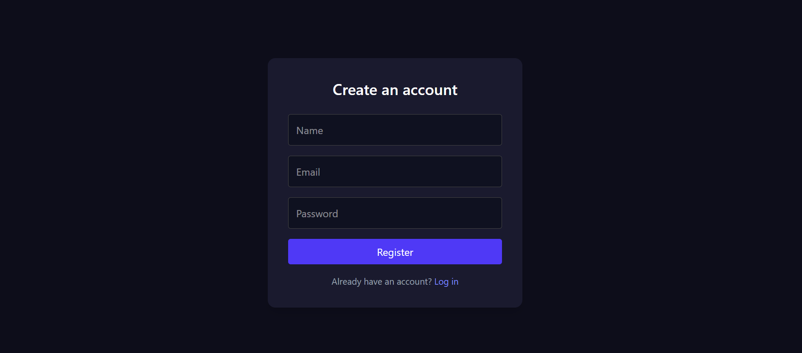
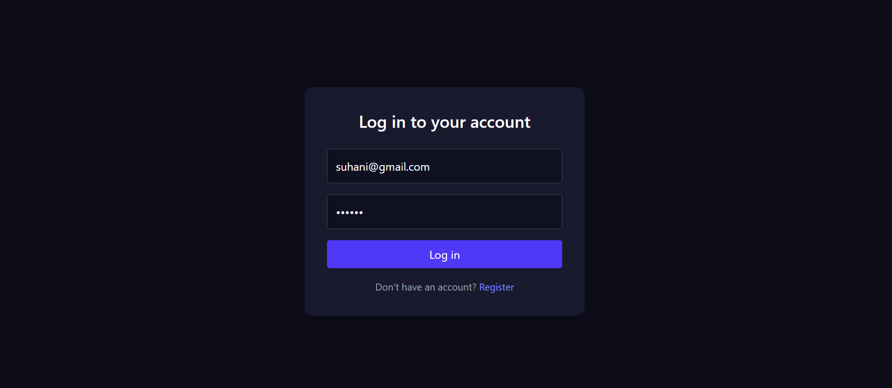
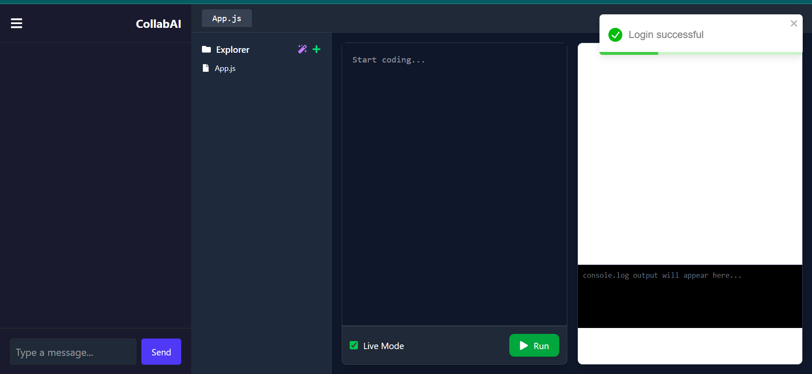
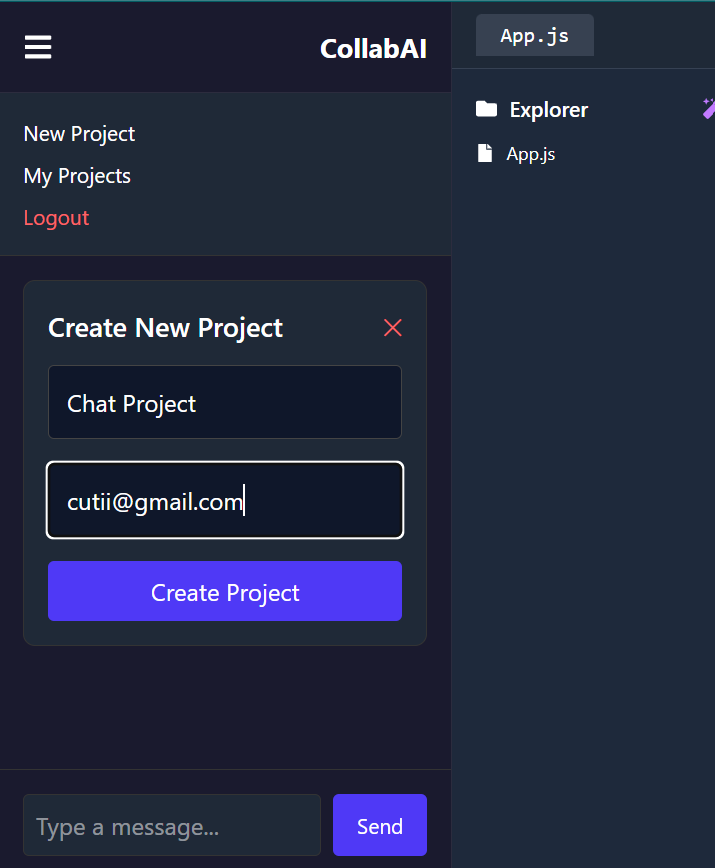
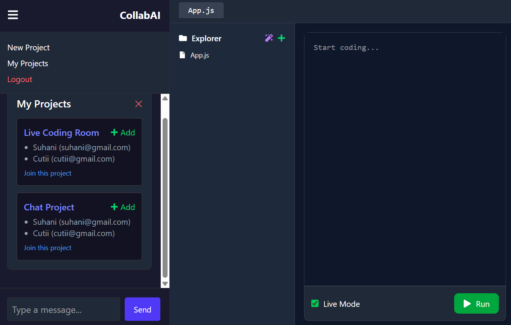
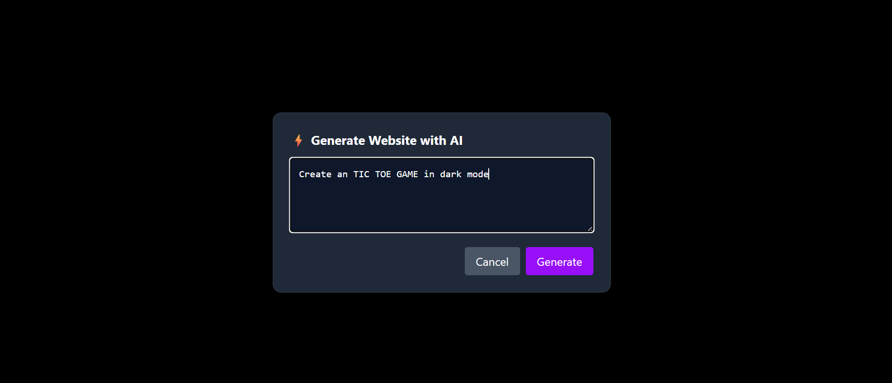
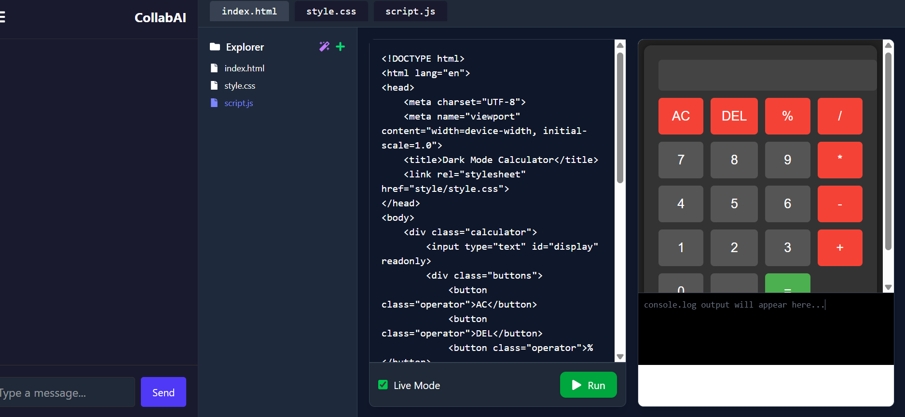
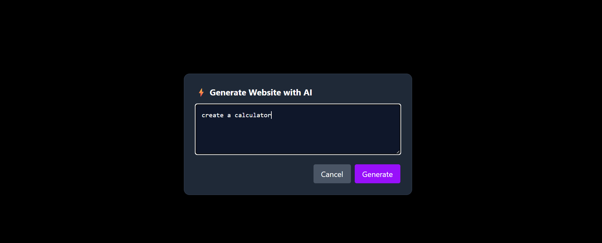

CollabAI is a full-stack web application that allows multiple users to collaborate on coding projects in real-time. It supports file/folder creation, live preview for HTML/CSS/JS, AI-assisted website generation, real-time chat, and project sharing with collaborators.

Features:
🔐 Authentication (Register/Login using JWT)

🧑‍🤝‍🧑 Multi-user project collaboration

📁 File and folder management

📝 Real-time code editing with Socket.IO

⚡ AI-powered website generation using Gemini or GPT

🖥️ Live preview for HTML/CSS/JS projects

💬 Chat system with persistent history

🔔 Toast notifications for events

👥 Invite collaborators via email

📦 MongoDB for persistent project and chat storage

📦 Tech Stack

💻 Frontend:
React.js
TailwindCSS
React Router
React Icons
React Toastify
Axios
Socket.IO-client
🧠 Backend:

Node.js
Express.js
MongoDB (via Mongoose)
JWT Authentication
Socket.IO
Google Gemini / OpenAI API (for AI website generation)

